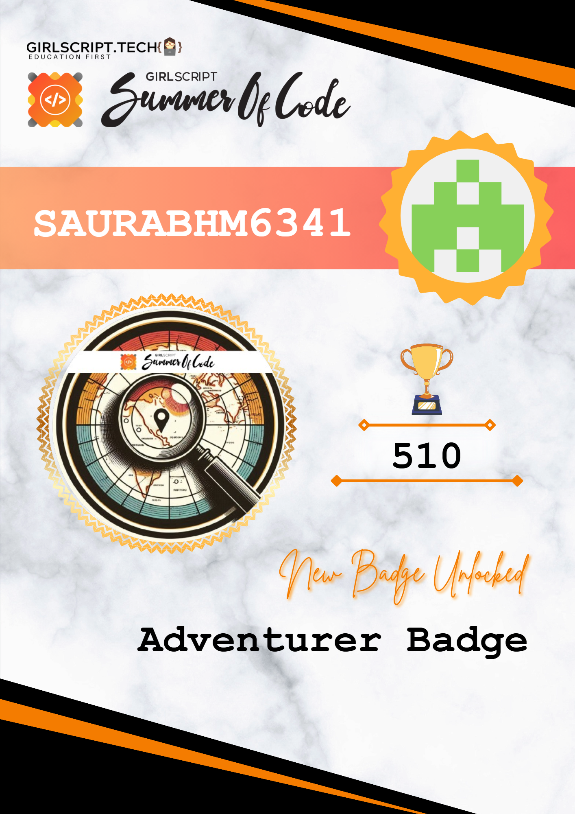
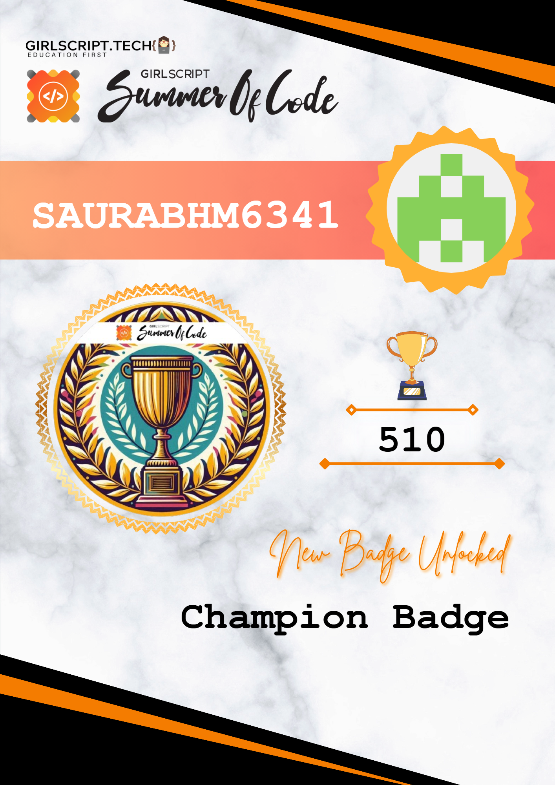
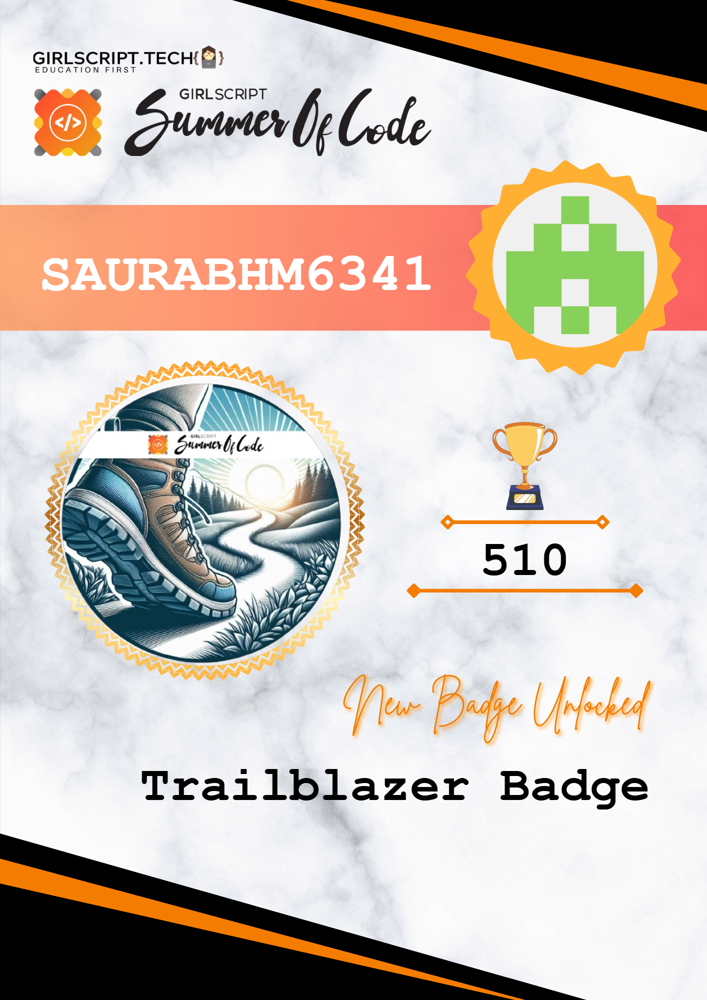
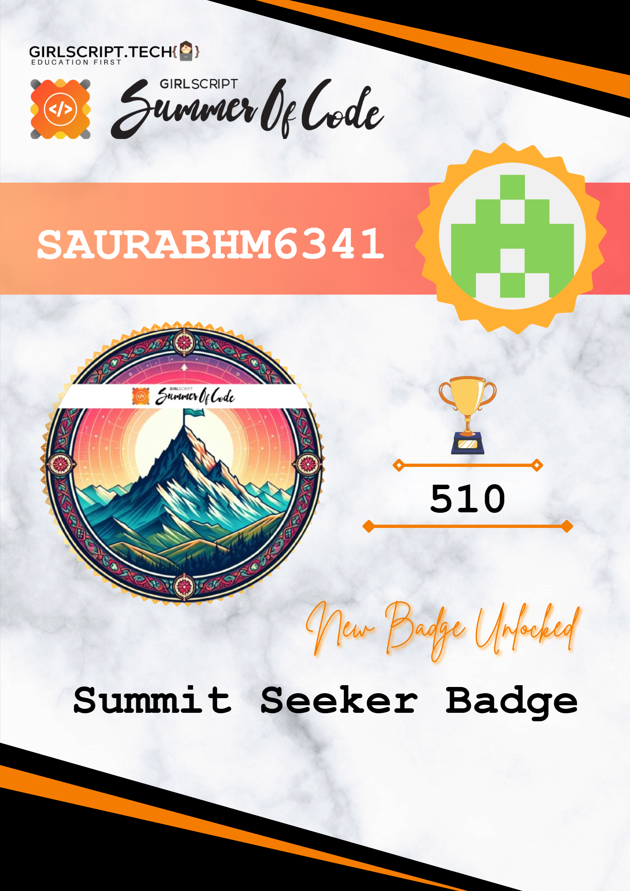
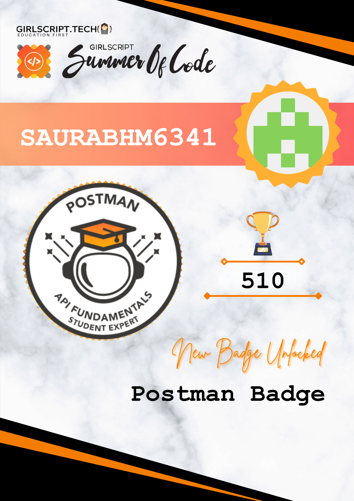

<h1 align="center">Hi 👋, I'm Saurabh Mishra</h1>
<h3 align="center">A passionate frontend developer from India</h3>

  

  

- 👨‍💻 All of my projects are available at (coming soon...)

- 📫 How to reach me **saurabhmishra6341@gmail.com**

- 📄 Know about my experiences (coming soon...)

<h3 align = "center">Badges and Achievements</h3>

<table>
  <tr>
    <td></td>
    <td></td>
    <td></td>
    </tr><tr><td></td>
    <td></td>
    <td></td>
  </tr>
</table>

<h3 align="left">Connect with me:</h3>

<h3 align="left">Languages and Tools:</h3>

        

&nbsp;

